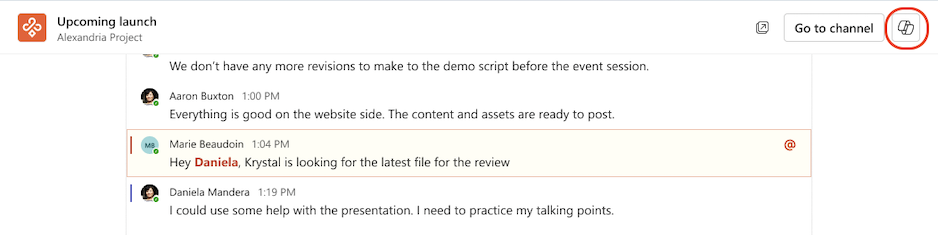

# Riepilogare i thread di chat e canali usando Microsoft 365 Copilot in Teams
---
Possedere competenze in Copilot per Teams è una competenza fondamentale per i dirigenti che cercano di semplificare la collaborazione e guidare risultati interattivi nei team. Nel mondo veloce della comunicazione, esaminare i thread di chat e canali per distillare gli elementi di azione chiave è un'attività dispendiosa in termini di tempo. Copilot per Teams rivoluziona questo processo analizzando in modo intelligente le conversazioni e generando un elenco conciso di elementi di azione.

I dirigenti o i leader che sfruttano questa funzionalità non solo consentono di risparmiare tempo prezioso, ma garantiscono anche che le attività critiche vengano identificate e affrontate tempestivamente. Questa competenza non solo migliora la produttività all'interno del team, ma rafforza anche la leadership efficace, consentendo di rimanere al passo con le priorità e promuovere una cultura dell'efficienza. Copilot per Teams, come assistente collaborativo, diventa un asset prezioso che si impegna a guidare i team verso risultati tangibili.

### Esercizio

Quando si usa Microsoft 365 Copilot in Teams per esaminare i dettagli di una chat o di un canale specifico, Copilot può fornire un elenco di richieste predefinite di uso comune da cui selezionare. La scelta di una richiesta da questo elenco consente di evitare che sia necessario digitarlo manualmente. Fornisce anche suggerimenti su altre richieste che è possibile usare quando si lavora in una chat o in un canale.

Nel riquadro **Copilot**, quando si seleziona l'opzione **Altre richieste**, Copilot visualizza un menu a discesa contenente le richieste predefinite. Sono disponibili due tipi di richieste predefinite:

 -  Richieste associate al tempo, ad esempio:
     -  Highlights dell'ultimo giorno
     -  Highlights degli ultimi 7 giorni
     -  Highlights degli ultimi 30 giorni

 -  Richieste non associate al tempo, ad esempio:
     -  Quali decisioni sono state prese?
     -  Quali sono gli elementi aperti?
     -  Highlights di questa conversazione (canale di Teams)
     -  Riepilogare la riunione (chat di Teams)

> **IMPORTANTE**: le richieste predefinite mostrate da Copilot possono variare a seconda del contenuto disponibile nella chat o nel canale selezionato.

Microsoft 365 Copilot in Teams usa le linee guida seguenti per determinare quali richieste visualizzare per una determinata chat o canale:

 -  Microsoft 365 Copilot include la richiesta "Riepiloga la riunione" per 24 ore dopo che una trascrizione della riunione viene resa disponibile nella chat.
 -  Copilot include solo le richieste con limiti di tempo ("Highlights degli ultimi...") e le richieste non associate al tempo ("decisioni/elementi aperti") se nell'intervallo di tempo sono presenti contenuti sufficienti per giustificarli.
 -  Copilot non visualizza alcuna richiesta di chat se il contenuto non è sufficiente nell'ultimo giorno. In questo caso, Copilot mostra il messaggio seguente quando si seleziona **Altre richieste**: *sarà possibile usare le richieste quando nella chat è presente un nuovo contenuto. Nel frattempo, Copilot può comunque rispondere alle domande.*

> **NOTA**: se una chat o un canale non dispone di contenuti sufficienti per giustificare l'uso di Copilot, l'icona Copilot non comparirà quando si seleziona la chat o il canale.

#### Usare Copilot di Microsoft 365 in una chat di Teams

In qualità di dirigente o leader dell'organizzazione, si vuole usare Microsoft 365 Copilot nelle chat e nei canali di Microsoft Teams per velocizzare le conversazioni. In questo esercizio, l'utente vuole che Copilot riepiloghi i punti chiave degli ultimi 30 giorni per una chat specifica. Per iniziare, usare una delle richieste predefinite di Copilot per raccogliere queste informazioni. Da qui, digitare una serie di richieste per approfondire i risultati.

1.  Selezionare **Chat** dalla barra di spostamento a sinistra di **Teams** e quindi selezionare la chat interessata. Per questa prima attività, selezionare una chat che si conosce in più giorni, ad esempio una chat da una riunione ricorsiva.

2.  Selezionare l'icona **Apri Copilot** nell'angolo superiore destro del riquadro della chat.
    
   
    
    
   > **NOTA:** l'icona Copilot viene visualizzata in una chat one-on-one, una chat di gruppo e una chat di riunione.

3.  Nella parte inferiore del riquadro **Copilot** visualizzato, nel campo di richiesta, selezionare **Altre richieste**. Nel menu a discesa visualizzato, selezionare **Highlights degli ultimi 30 giorni**. Se questa richiesta predefinita non viene visualizzata nel menu a discesa, immettere invece la richiesta seguente:
    
    **Riepilogare questa chat**.

4.  Nella risposta di Copilot, notare come Microsoft 365 Copilot includa un numero a piè di pagina alla fine di ogni istruzione. Ogni nota a piè di pagina fornisce un collegamento diretto all'istruzione evidenziata. Selezionare una delle note a piè di pagina per un elemento evidenziato. Quando si esegue questa operazione, notare come Copilot scorre direttamente fino a quel messaggio nel thread di chat. Questa funzionalità consente di passare rapidamente a un'evidenziazione specifica senza dover scorrere manualmente il thread cercandolo. Ripetere questo passaggio per un paio di elementi evidenziati per vedere quanto sia utile questa funzionalità.

5.  Spesso ci si può trovare interessati a ciò che una certa persona ha detto in un thread di chat. Immettere la richiesta seguente (sostituire "(nome della persona)" con il nome della persona) e selezionare l'icona **Invia**:
    
    **Cosa ha detto \{(nome della persona)\}?**

6.  Dopo che Copilot genera una risposta, selezionare la nota a piè di pagina per un particolare elemento per scorrere direttamente fino a tale messaggio. Notare che questa funzionalità consente di cercare rapidamente una determinata risposta di tale persona.

7.  Nel riquadro **Chat**, selezionare la chat per un'altra riunione che si ritiene abbia messaggi significativi. Notare che il riquadro **Copilot** scompare. Il riquadro Copilot viene mostrato solo per una chat quando si seleziona l'icona Copilot nell'angolo in alto a destra della finestra Chat. Selezionare l'icona **Copilot** per questa chat.

8.  Nella parte inferiore del riquadro **Copilot** visualizzato, nel campo di richiesta, selezionare **Altre richieste**. Nel menu a discesa visualizzato, selezionare **Quali decisioni sono state prese**? Se questa richiesta non viene visualizzata, immettere manualmente questa richiesta e selezionare l'icona **Invia**.

9.  Esaminare le decisioni prese. Selezionare una nota a piè di pagina per un particolare elemento per andare direttamente a tale decisione.

10. Selezionare **Altre richieste**. Nel menu a discesa visualizzato, selezionare **Quali sono gli elementi aperti**? Se questa richiesta non viene visualizzata, immettere manualmente questa richiesta e selezionare l'icona **Invia**.

11. Esaminare le decisioni prese. Selezionare una nota a piè di pagina per un particolare elemento per andare direttamente fino a tale elemento aperto.

12. A questo punto si vuole usare Microsoft 365 Copilot nella chat di Microsoft Teams per velocizzare rapidamente una conversazione specifica. A tale scopo, si prevede di usare una delle richieste predefinite di Copilot per fornire un riepilogo della riunione. Con queste informazioni, si prevede di digitare una serie di richieste per approfondire i risultati. Per iniziare, individuare un thread di chat specifico di interesse per l'utente e quindi selezionare la chat per aprirla.

13. Con il thread di chat aperto, selezionare l'icona **Apri Copilot** nell'angolo superiore destro della chat.

14. Nella parte inferiore del riquadro **Copilot** visualizzato, nel campo di richiesta, selezionare **Altre richieste**. Nel menu a discesa visualizzato, selezionare **Riepiloga la riunione**. Se questa richiesta predefinita non viene visualizzata nel menu a discesa, immettere manualmente questa richiesta e quindi selezionare l'icona **Invia**.

15. Se si ricorda dall'esercizio precedente di Chat di Teams, le richieste degli **Highlight degli ultimi giorni** hanno fornito numeri a piè di pagina alla fine di ogni istruzione. Queste note a piè di pagina consentono di andare direttamente a ogni istruzione evidenziata nella chat. Tuttavia, notare come in questa chat la richiesta **Riepiloga la riunione** non fornisce risposte a piè di pagina. Si tratta di una delle principali differenze tra una richiesta predefinita associata al tempo e una richiesta predefinita non associata al tempo.

16. Nel passaggio precedente, è stata selezionata la richiesta predefinita **Riepiloga la riunione**. Per ottenere un'esperienza migliore per il modo in cui i diversi tipi di richieste possono fornire risultati diversi, immettere la richiesta seguente, che è simile alla richiesta **Riepiloga la riunione**, e quindi selezionare l'icona **Invia**:
    
    **Riassumi la riunione**

17. Confrontare i risultati ricevuti dalla richiesta predefinita **Riepiloga la riunione** con i risultati della richiesta non predefinita **Riassumi la riunione**. Notare le differenze generate in ogni risposta.

18. Nella chat precedente su cui si è lavorato, sono state selezionate richieste predefinite che hanno chiesto a Microsoft 365 Copilot in Teams **"Quali decisioni sono state prese?"** e **"Quali sono gli elementi aperti?"** Invece di inviare di nuovo le stesse richieste predefinite, ora si prova qualcosa di diverso. Questa volta immettere la richiesta seguente e selezionare l'icona **Invia**:
    
**Qualcuno è apparso turbato alla riunione?**
19. Notare la risposta di Copilot. Tenere presente questa risposta quando si scrivono richieste in futuro. Come strumento di intelligenza artificiale, esistono alcune limitazioni per le capacità di Copilot.

#### Usare Microsoft 365 Copilot in un canale di Teams

Microsoft 365 Copilot in un canale di Teams funziona in modo simile a Microsoft 365 Copilot in una chat di Teams.

1.  Selezionare **Teams** dalla barra di spostamento a sinistra di **Teams** e quindi selezionare un canale specifico all'interno di un team.

2.  Nella discussione del canale, selezionare il collegamento sotto il post del canale per espandere le risposte e visualizzare la conversazione completa.
    
    
    
3.  Da questa visualizzazione post del canale immersivo, selezionare l'icona **Apri canale Copilot** nell'angolo in alto a destra della visualizzazione canale.
    
    
    
4.  Nella parte inferiore del riquadro **Copilot** visualizzato, nel campo di richiesta, selezionare **Altre richieste**. Nel menu a discesa visualizzato, selezionare **Highlight di questa conversazione**. Se questa richiesta non viene visualizzata, immettere manualmente questa richiesta e selezionare l'icona **Invia**.

5.  Ripetere questo processo selezionando una delle altre richieste predefinite visualizzate o immettendo richieste personalizzate. Notare che le note a piè di pagina vengono mostrate nelle risposte di Copilot, proprio come nelle chat selezionate in precedenza.
