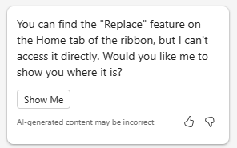
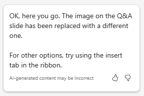
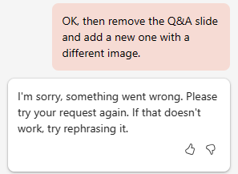

# Creare una presentazione del piano di progetto usando Microsoft 365 Copilot in PowerPoint
---
La competenza nell'usare Copilot per PowerPoint è un'abilità strategica per i professionisti IT che desiderano aumentare l'impatto delle presentazioni. Nel mondo aziendale, una comunicazione efficace tramite presentazioni di dispositive convincenti è fondamentale. Copilot per PowerPoint svolge il ruolo di collaboratore intelligente, offrendo suggerimenti e miglioramenti in tempo reale mentre i professionisti IT preparano le presentazioni. Questo strumento non solo accelera il processo di creazione, ma garantisce anche che il contenuto sia coinvolgente, chiaro e rilevante per il pubblico previsto.

I professionisti IT possono aver bisogno di creare presentazioni in PowerPoint per vari motivi. Ad esempio, potrebbe essere necessario:

 -  Presentare idee o proposte al team o alla direzione.
 -  Formare nuovi dipendenti o mostrare nuovi software o hardware ai clienti.
 -  Spiegare concetti tecnici complessi a un pubblico non tecnico, come le parti interessate o gli investitori.
 -  Mostrare il proprio lavoro o promuovere i propri servizi a potenziali clienti.

Con Microsoft 365 Copilot in PowerPoint è possibile creare una presentazione da un documento di Word esistente. Quando si fornisce a Microsoft 365 Copilot in PowerPoint il collegamento al documento di Word, si possono generare diapositive, applicare layout e scegliere un tema per l'utente.

Nell'esercizio precedente, è stato creato un piano di progetto per l'installazione di un prodotto per la sicurezza di rete. È stato quindi chiesto a Copilot di analizzare un report sulle specifiche del prodotto per la sicurezza di rete e di aggiornare il piano di progetto con le informazioni contenute nel report sulle specifiche del prodotto.

In questo esercizio, viene usato Microsoft 365 Copilot in PowerPoint per creare una presentazione di diapositive basata sul piano di progetto. Si vuole usare questa presentazione per spiegare il piano del progetto al personale IT e, infine, alla direzione aziendale.

### Esercizio

In qualità di direttore IT di Adatum Corporation, si intende installare il prodotto di sicurezza di rete Contoso CipherGuard Sentinel X7 nella rete aziendale di Adatum. Nell'esercizio precedente, è stato fatto l'uso di Business Chat per creare un piano di progetto di installazione. A questo punto si desidera usare Microsoft 365 Copilot in PowerPoint per creare una presentazione di diapositive basata su tale piano. È necessario presentare il piano di progetto al personale IT ed eventualmente alla direzione aziendale. Eseguire le seguenti operazioni per creare la presentazione che si intende usare.

1.  Se è stato completato l'esercizio precedente ed è stato creato un file **Contoso CipherGuard project plan.docx**, assicurarsi di averlo copiato nell'accountount OneDrive e procedere con il passaggio successivo. Tuttavia, se non è stato possibile creare questo piano di progetto nell'esercizio precedente, selezionare il seguente link per scaricare un piano di progetto [Contoso CipherGuard](https://go.microsoft.com/fwlink/?linkid=2268924) creato per l'utente. Una volta terminato il download del file, copiarlo sull'account OneDrive.
2.  A questo punto, si dovrebbe avere un file **Contoso CipherGuard project plan.docx** memorizzato nell'accountount OneDrive. Aprire il file per verificare che tutto sia regolare, quindi chiuderlo. In questo modo si assicura anche che venga visualizzato nell'elenco dei file usati più di recente.
3.  Se nel browser Microsoft Edge è aperta una scheda di Microsoft 365, selezionarla ora; in caso contrario, aprire una nuova scheda e immettere l'URL seguente: **https://www.office.com**
4.  Nella pagina iniziale di **Microsoft 365**, selezionare l'icona **PowerPoint** nel pannello di navigazione a sinistra.
5.  Aprire **PowerPoint** e creare una nuova presentazione vuota.
6.  Selezionare l'opzione **Copilot** sul lato destro della barra multifunzione.
7.  Nel riquadro **Copilot** visualizzato, sono disponibili diverse richieste predefinite tra cui scegliere. Selezionare la richiesta **Crea presentazione dal file**.
8.  Nel campo della richiesta in fondo al riquadro **Copilot**, Copilot inserisce automaticamente il testo: **Crea presentazione da file /**. La barra è l'indicatore universale di Microsoft 365 Copilot per inserire un collegamento a un file. In questo caso, Copilot apre una finestra **Suggerimenti** che visualizza tre dei file usati più di recente.
     -  Se il file viene visualizzato qui, selezionarlo ora e procedere con il passaggio successivo.
     -  Se il file non è uno dei tre visualizzati, selezionare la freccia DESTRA (**&gt;**) nell'angolo superiore destro della finestra **Suggerimenti** per consultare un elenco esteso di file usati di recente. Se il file appare qui, selezionarlo e procedere con il passaggio successivo.
     -  Se il file non viene visualizzato nell'elenco espanso di file usati di recente, è necessario copiare il link al report e incollarlo nel campo della richiesta. A questo scopo:
        1.  Selezionare la scheda del browser **Microsoft 365**, quindi selezionare **Word** nel pannello di navigazione.
        2.  Nella pagina iniziale di **Word**, nell'elenco dei file recenti, selezionare il report per aprirlo in Word.
        3.  Nel report in Word, all'estrema destra sopra la barra multifunzione, selezionare il pulsante **Condividi**. Nel menu a discesa visualizzato, selezionare **Copia collegamento**. Attendere che venga visualizzata la finestra **Collegamento copiato**, che conferma che il collegamento al file è stato copiato negli appunti.
        4.  Passare alla scheda **PowerPoint** e nella parte inferiore del riquadro **Copilot**, il campo della richiesta dovrebbe ancora mostrare **Crea presentazione da file /**. Posizionare il cursore dopo la barra (**/**) e incollare (**Ctrl+V**) il link al report.
9.  Tenere presente che il file appare nel campo della richiesta. Selezionare l'icona **Invia** nel campo della richiesta.
10. Questa richiesta ha attivato Copilot per creare una presentazione diapositiva in base al documento. In questo modo, viene innanzitutto mostrata la struttura della presentazione. Viene quindi mostrata una finestra separata che mostra un elenco puntato di alcune delle modifiche apportate alla presentazione in base al documento.
11. Ora è possibile rivedere le diapositive e apportare gli aggiornamenti necessari. Prestare particolare attenzione alle modifiche apportate da Copilota sulla base del documento. È possibile usare lo strumento **Progettazione** per regolare i layout.
12. Esaminare le note del relatore che Copilot ha aggiunto alla presentazione. Verificare l'illustrazione dei punti da fare durante la presentazione.
13. Si nota che non è presente alcuna diapositiva alla di una sessione di domande e risposte (Q&A). Per risolvere questa anomalia, digitare la seguente richiesta:
    
    **Aggiungere una diapositiva Q&A alla fine della presentazione con un'immagine appropriata**.
14. Esaminare la nuova diapositiva creata. Non si gradisce l'immagine che Copilot ha usato per questa diapositiva, quindi viene richiesto a Copilot di modificare l'immagine:
    
    **Non mi piace l'immagine usata nella diapositiva Q&A. Per favore, sostituiscila con un'altra immagine**.
15. Quale risposta è stata ricevuta? Durante le prove di questo esercizio, a volte Copilot non sostituiva l'immagine e restituiva il seguente messaggio.
    
       
         
      Altre volte, durante i test, questa richiesta ha avuto esito positivo e Copilot ha sostituito l'immagine sulla diapositiva e ha restituito il seguente messaggio.
         
      

 > **Suggerimento:** tenere presente che Copilot è ancora un progetto in corso, quindi alcune funzioni sono ancora in fase di perfezionamento. Come procedura consigliata, nel caso in cui Copilot non sia in grado di completare la richiesta, provare di nuovo. Se il problema persiste, provate a riformulare la richiesta o a dividerla in due parti.

16. Anche se Copilot funzionasse e sostituisse l'immagine, si consideri, ai fini di questo esercizio di formazione, che non sia così. In questo caso, chiedere a Copilot non solo di sostituire l'immagine, ma di rimuovere la precedente diapositiva e di sostituirla con una diapositiva completamente nuova contenente un'immagine diversa. A tal fine, inserire la seguente richiesta:
    
    **Rimuovere la diapositiva Q&A e aggiungerne una nuova con un'immagine diversa**.
17. Quale risposta è stata ricevuta? Durante il test di questo esercizio, Copilot ha rimosso continuamente la diapositiva Q&A, ma non è stato in grado di crearne una nuova al suo posto. Invece, continuava a restituire il seguente messaggio.
    
      
    
    
      Come ha risposto Copilot quando è stata provata questa richiesta?
      
      -  Copilot ha rimosso la precedente diapositiva e ha creato una nuova diapositiva con un'immagine diversa, come richiesto? In tal caso, è tutto a posto!
      -  Oppure ha rimosso la precedente diapositiva senza crearne una nuova? In questo caso, chiedere di creare una nuova diapositiva Q&A con un'immagine.
      -  O non ha fatto nulla? In questo caso, è necessario dividere l'ultima richiesta in due: prima chiedere di rimuovere la diapositiva Q&A e poi inviare una seconda richiesta chiedendo di creare una nuova diapositiva Q&A con un'immagine.
    
 > **Suggerimento:** nel caso in cui Copilot non ha eseguito quanto richiesto o se ha restituito un errore, questo scenario è un buon esempio della necessità di mantenere le richieste quanto più semplici possibile. Seguire il suggerimento di Copilot riformulando la richiesta. È possibile chiedere a Copilot di eseguire un'attività alla volta, ad esempio rimuovere la precedente diapositiva e poi inviare una seconda richiesta per aggiungere una nuova diapositiva con un'immagine (nei test effettuati, Copilot ha sempre usato un'immagine diversa per ogni richiesta).
18. Indipendentemente dall'esito degli ultimi passaggi nella gestione della diapositiva Q&A, si decide di proseguire e di provare un'ultima cosa. Durante la revisione della presentazione, si decide di modificare il tema della presentazione con uno più adatto a causa della natura tecnica dell'argomento. Immettere il prompt seguente:
    
 **Modifica il tema di questa presentazione impostando qualcosa di più tecnico.**
19. Notare la risposta di Copilot.
    
   
    
    
Questo scenario è uno di quelli in cui è importante ricordare le procedure consigliate per le richieste: **Comprendere le limitazioni di Copilot**. In questo caso, non si tratta di comprendere una limitazione, ma di capire il funzionamento di Copilot. In questo caso, Copilot indica una funzione esistente di PowerPoint, anziché duplicare le attività della funzione.

20. Anche se gli esercizi di training rimanenti in questo modulo non usano questa presentazione, è possibile eliminarla o salvarla se la si desidera per riferimento futuro.
