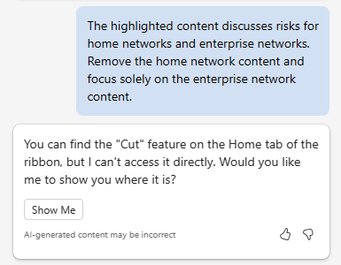
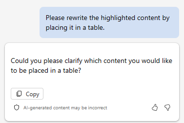
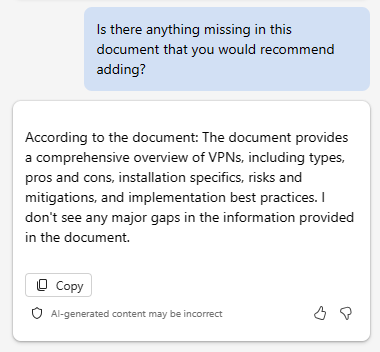

Aggiornare un report tecnico con Microsoft 365 Copilot in Word
---
Microsoft 365 Copilot in Word è un assistente di scrittura basato sull'intelligenza artificiale che può aiutare i professionisti IT a creare documenti in modo più efficiente. Quando si crea un nuovo documento o si lavora su un documento esistente, Copilot può aiutare in diversi modi.

 -  In un nuovo documento vuoto o quando si desidera aggiungere contenuto a un documento esistente, è possibile indicare a Copilot cosa si vuole scrivere e generare il contenuto di conseguenza. Ad esempio, si potrebbe dire a Copilot "Scrivere un saggio sui vantaggi del cloud computing" o "Creare un paragrafo sull'importanza della cybersecurity." Se si desidera, è possibile includere fino a tre file esistenti come input per mettere le basi del contenuto che Copilot abbozza. In alternativa, Copilot può basare il nuovo contenuto sui dati Web pubblici.
 -  In un documento con contenuto esistente, Copilot consente di trasformare il contenuto. Può riscrivere il contenuto selezionato o anche trasformare il contenuto selezionato in una tabella.

In generale, Microsoft 365 Copilot in Word può aiutare i professionisti IT a risparmiare tempo e impegno durante la creazione di documenti. Può essere utile per generare contenuto, riscrivere testo e fornire suggerimenti utili. Grazie all'assistenza per la scrittura basata sull'intelligenza artificiale, Copilot consente di creare documenti in modo più efficiente ed efficace.

In questo esercizio, si usa Microsoft 365 Copilot in Word per aggiornare un documento esistente. Si indica a Copilot di aggiungere nuovo testo, riscrivere il testo esistente e trasformare il testo in una tabella.

### Esercizio

Fabrikam è interessato all'implementazione di una rete privata virtuale (VPN) nella rete aziendale. A tale scopo, ha stipulato un contratto con Trey Research, una delle aziende di consulenza IT più affermata a livello nazionale, per assistere nell'implementazione. Per aiutare a rendere operativo il progetto, i membri del gruppo di consulenza di rete di Trey Research hanno creato un report per il personale IT di Fabrikam che offre una panoramica delle VPN. Lo scopo del report è quello di informare il team di progetto Fabrikam sulle VPN prima di iniziare l'implementazione.

In qualità di consulente responsabile di Trey Research, si è responsabili della gestione del progetto Fabrikam. Il compito è presentare questo documento a Fabrikam e aggiornarli sulle specifiche dell'implementazione delle VPN. Tuttavia, dopo aver esaminato il report, viene deciso di apportare altre modifiche. Sebbene la versione preliminare del team è stata completata correttamente, sembra che manchino un paio di informazioni chiave e si vogliono riformattare parti di esso per semplificare il processo per Fabrikam. Si prevede di usare Microsoft 365 Copilot in Word per facilitare questo lavoro. Per farlo, effettua i seguenti passaggi:

1.  Selezionare il collegamento seguente per scaricare una copia del report [Trey Research - Panorama tecnica delle VPN](https://go.microsoft.com/fwlink/?linkid=2269129).
2.  Al termine del download, spostare il file dalla cartella **Download** a una cartella nell'account di OneDrive.
3.  In **Microsoft 365**, aprire **Microsoft Word**.
4.  Aprire il file **Trey Research - Panoramica tecnica delle VPN**.
5.  Sulla barra multifunzione di **Word**, selezionare il pulsante **Copilot** per aprire il riquadro Copilot.
6.  Nel riquadro **Copilot**, immettere la richiesta seguente e quindi selezionare l'icona freccia (**Invia**):
    
    **Scrivere una nuova sezione per questo documento sui tipi di VPN. Discutere i vantaggi e i svantaggi di ogni tipo. Questo contenuto è destinato a un pubblico tecnico, quindi fornire dettagli specifici.**
7.  Come si può notare, Copilot non aggiunge nuovi contenuti direttamente in un documento. Mostra il contenuto in una finestra di risposta nel riquadro Copilot. Tuttavia, fornisce un pulsante **Copia** nella parte inferiore di ogni finestra di risposta, quindi selezionare il pulsante **Copia** per copiarne il contenuto negli Appunti. Esaminando il documento, viene deciso di incollare il contenuto sotto il paragrafo di apertura. Incollare ora il contenuto.
    
    > **SUGGERIMENTO:** quando si seleziona il pulsante **Copia** per una finestra di risposta, copia TUTTO il contenuto, inclusi i commenti di Copilot destinati all'utente. Questi tipi di commenti sono in genere all'inizio e alla fine della risposta. Assicurarsi di rimuovere questi commenti dopo aver incollato la risposta nel documento. È probabile che il tipo e le dimensioni del carattere del nuovo contenuto non corrispondano al tipo e alle dimensioni del carattere esistenti usati in tutto il documento. Di conseguenza, è necessario modificarli in modo che corrispondano.

8.  Dopo aver esaminato ulteriormente, si noterà che non è presente alcuna menzione dei criteri di sicurezza correlati all'utilizzo della VPN. Questo argomento è un'area chiave che si vuole includere, quindi immettere la richiesta seguente:
    
    **Scrivere una nuova sezione per questo documento sui criteri di sicurezza correlati all'utilizzo della VPN. Questo contenuto è destinato a un pubblico tecnico, quindi fornire dettagli specifici.**
9.  Copiare e incollare il contenuto da questa risposta nel documento. Posizionarlo subito prima della sezione **Rischi e mitigazioni** e quindi modificare il contenuto in base alle esigenze. Se necessario, aggiungere un'intestazione per questa sezione intitolata **Criteri di sicurezza correlati all'utilizzo della VPN**.
10. Quando è stato esaminato il report, è stata identificata anche un'area di contenuto che si ritiene necessario riscrivere. Nella sezione **Rischi e mitigazioni**, il primo punto riguarda sia le VPN domestiche che le VPN aziendali. Si vuole che si tratti solo di VPN aziendali. Tuttavia, dato il modo in cui viene scritto il contenuto, non sembra essere una correzione semplice. Viene deciso di far riscrivere automaticamente il contenuto a Copilot.
    
    > **SUGGERIMENTO:** per far riscrivere il contenuto a Copilot, è prima necessario evidenziare il contenuto che si vuole far riscrivere.
    
11. Evidenziare il contenuto nel primo punto della sezione **Rischi e mitigazione** e quindi immettere la richiesta seguente:
    
    **Il contenuto evidenziato illustra i rischi dell'uso di VPN sia nelle reti domestiche che nelle reti aziendali. Rimuovere il contenuto correlato alle reti domestiche e concentrarsi esclusivamente sui rischi delle VPN nelle reti aziendali.** 
12. Notare la risposta di Copilot. Nei test di questo esercizio, a volte questa funzionalità di riscrittura non funzionava. Quando non funziona, Copilot restituiva la risposta seguente. Se si verifica questa situazione, copiare e incollare la richiesta e riprovare (ricorda, iterare, iterare, iterare).

    
    
    
    Tuttavia, quando la funzionalità di riscrittura ha funzionato, ha sostituito il contenuto evidenziato con nuovo contenuto che non ha fatto menzione di VPN nelle reti domestiche. La funzionalità di riscrittura ha funzionato?
14. Dopo aver eseguito un passaggio finale attraverso il documento, un'ultima cosa cattura l'occhio. Viene deciso che le sezioni relative ai vantaggi e ai svantaggi dell'implementazione delle VPN risulterebbero migliori in una tabella anziché come elenchi puntati. Poiché è stata evidenziata una sezione da riscrivere, viene deciso di evidenziare queste due sezioni. Evidenziare entrambe le sezioni e quindi immettere la richiesta seguente:
    
    **Riscrivere il contenuto evidenziato inserendolo in una tabella**.
15. Notare la risposta di Copilot.

    
    
16. La riformattazione del contenuto in una tabella è diversa dalla riscrittura del contenuto. Anziché evidenziare il contenuto che si desidera inserire in una tabella, è necessario descrivere nella richiesta le sezioni del contenuto desiderate nella tabella. Immettere la richiesta seguente:
    
    **Inserire il contenuto dei vantaggi e dei svantaggi dell'implementazione delle VPN in una tabella**.
17. Notare la risposta di Copilot. Anziché riscrivere o sostituire il contenuto esistente nel documento con una tabella, mostra la tabella nella risposta. È necessario sostituire il contenuto copiando e incollando la tabella nel documento. Nella risposta, selezionare il pulsante **Copia** e quindi nel documento evidenziare le sezioni vantaggi e svantaggi e incollare la tabella. Assicurarsi di aggiungere un'intestazione di sezione prima della tabella che indica: **Vantaggi e svantaggi dell'implementazione delle VPN.** È probabile che sia anche necessario modificare il tipo e le dimensioni del carattere del contenuto della tabella in modo che corrispondano al tipo e alle dimensioni del carattere esistente usato in tutto il documento.
18. A questo punto, viene deciso che il documento è completo. Tuttavia, per andare sul sicuro, viene deciso di chiedere a Copilot se ritiene che il documento debba includere qualsiasi altra informazione. Immettere il prompt seguente:
    
    **C'è qualcosa di mancante in questo documento che si consiglia di aggiungere?**
19. Notare la risposta di Copilot. Nei test, a volte ci ha detto che non mancava nulla.

    
    
    
    Altre volte ci ha detto che nel documento mancava una parte chiave di informazioni.
    
    
    
19. Se Copilot ha consigliato di aggiungere altri contenuti al documento, creare una richiesta per farlo. È quindi possibile copiare e incollare il nuovo contenuto nel documento.
20. A questo punto, assicurarsi che il documento venga salvato con tutte le modifiche. Verrà usata di nuovo nell'esercizio successivo.
