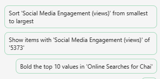

# Analizzare un foglio di calcolo delle tendenze di mercato usando Microsoft 365 Copilot in Excel
---
I professionisti del marketing possono usare Microsoft 365 Copilot in Excel per analizzare i dati e ottenere informazioni dettagliate sull'azienda. Microsoft 365 Copilot in Excel è uno strumento potente che consente ai professionisti del marketing di creare, modificare, comprendere e visualizzare i dati con facilità.

Ad esempio, possono usare Microsoft 365 Copilot in Excel per analizzare i risultati aziendali trimestrali, riepilogare le tendenze chiave, applicare la codifica a colori alle tabelle, creare modelli, scenari, filtrare e ordinare e aggiungere grafici con un semplice clic del mouse. Le funzionalità basate sull'intelligenza artificiale di Copilot possono aiutare i professionisti del marketing a risparmiare tempo e impegno automatizzando le attività ripetitive e fornendo informazioni preziose che possono aiutarli a prendere decisioni informate. Usando Microsoft 365 Copilot in Excel, possono concentrarsi sugli obiettivi e sugli obiettivi aziendali più importanti.

Microsoft 365 Copilot in Excel è uno strumento prezioso per i professionisti del marketing. Offre un'ampia gamma di vantaggi, tra cui:

 -  **Evidenzia, filtra e ordina i dati senza sforzo**: Microsoft 365 Copilot in Excel può aiutare i professionisti del marketing a identificare e organizzare rapidamente i dati evidenziandoli, filtrandoli e ordinandoli. Ad esempio, un professionista del marketing può usare Copilot per filtrare i dati irrilevanti da un set di dati di grandi dimensioni, ad esempio i dati demografici della clientela e concentrarsi sui dati più rilevanti per gli obiettivi di marketing.
 -  **Generare suggerimenti per la colonna della formula per calcoli complessi**: Microsoft 365 Copilot in Excel può aiutare i professionisti del marketing a generare suggerimenti di formule per calcoli complessi, ad esempio il calcolo del ritorno sugli investimenti (ROI) delle campagne di marketing. Ad esempio, un professionista del marketing può usare Copilot per calcolare il ROI della campagna di marketing tramite posta elettronica dividendo i ricavi generati dalla campagna in base al costo della campagna.
 -  **Assistenza con l'analisi, la comprensione e la visualizzazione dei dati**: Microsoft 365 Copilot in Excel può aiutare i professionisti del marketing ad analizzare, comprendere e visualizzare i dati usando la potenza dell'intelligenza artificiale. Ad esempio, un professionista del marketing può usare Copilot per identificare le tendenze nei dati di vendita e usare queste informazioni dettagliate per prendere decisioni informate sulle strategie di marketing.

Quando si usa Microsoft 365 Copilot in Excel, è necessario disporre di una tabella di Excel che include dati in un foglio di lavoro. È possibile trasformare rapidamente un intervallo di celle in una tabella di Excel seguendo questa procedura:

1.  Selezionare la cella o l'intervallo nei dati.
2.  Selezionare il formato **home**&gt;**come tabella**.
3.  Nella finestra di dialogo **Formato come tabella** selezionare la casella di controllo accanto a **Tabella personale con intestazioni** se si desidera che la prima riga dell'intervallo sia la riga di intestazione.
4.  Seleziona **OK**.

In questo esercizio si usa Microsoft 365 Copilot in Excel per analizzare un foglio di calcolo delle tendenze di mercato che dispone già di una tabella di Excel definita. Questo esercizio esamina molte delle funzioni predefinite e delle richieste di Copilot. 

### Esercizio

In qualità di direttore del marketing per Contoso Beverage, una divisione di Contoso, Ltd., si è ricevuto un foglio di calcolo delle tendenze di mercato che mostra l'attività mensile per il prodotto Chai Tea di Contoso nel 2023. Si vogliono usare le funzionalità di Microsoft 365 Copilot in Excel per analizzare il report e fornire un'analisi dettagliata delle tendenze di marketing mensili nel 2023. In questo esercizio verranno esaminate le varie richieste e funzionalità predefinite fornite da Microsoft 365 Copilot in Excel.

Seguire questa procedura per analizzare il foglio di calcolo delle tendenze di mercato usando Microsoft 365 Copilot in Excel:

1.  Se il foglio di calcolo [Tendenze di mercato di Contoso Chai Tea 2023](https://go.microsoft.com/fwlink/?linkid=2268822) è stato scaricato nell'esercizio precedente, procedere con il passaggio successivo. In caso contrario, selezionare il collegamento per scaricare il file, spostarlo nell'account di OneDrive e quindi aprire e chiudere il file per ottenerlo nell'elenco dei file usati di recente.
2.  Se nel browser Microsoft Edge è aperta una scheda di Microsoft 365, selezionarla ora; in caso contrario, aprire una nuova scheda e immettere l'URL seguente: **https://www.office.com**
3.  Nella home page di **Microsoft 365**, selezionare l'icona di **Excel** nel pannello di navigazione a sinistra.
4.  Nella pagina **File**in **Excel**, selezionare **Tendenze di mercato di Chai Tea Contoso Chai Tea 2023.xlsx** dall'elenco di file.
5.  Selezionare l'opzione **Copilot** sul lato destro della barra multifunzione.
6.  Nel riquadro **Copilot** visualizzato, sono disponibili diverse richieste predefinite tra cui scegliere. Selezionare il pulsante **Mostra informazioni dettagliate sui dati**.
    
  
    
7.  Notare il grafico pivot generato. Quando è stato testato questo esercizio, Copilot ha sempre creato un grafico a linee di **Social Media Engagement (visualizzazioni) per data**. Quale tipo di grafico ha creato Copilot? Sotto il grafico creato da Copilot selezionare il pulsante **+Aggiungi a un nuovo foglio**.
8.  Selezionare **Foglio 2**. Esaminare il nuovo foglio dati creato da Copilot. Microsoft 365 Copilot includeva sia il grafico che la colonna di dati del foglio di calcolo che rappresentava la base di questo grafico. Tenere il cursore sul grafico e notare la finestra visualizzata che indica il tipo di grafico generato da Copilot.
9.  Notare che nel riquadro Copilot, l'elenco delle richieste predefinite non viene più visualizzato. Questa situazione si verifica perché Copilot non funziona ancora nelle tabelle pivot (notare il messaggio che indica questo problema). Selezionare **Foglio 1**, che consente di tornare alla tabella di Excel. Notare come vengono visualizzate le richieste predefinite.
10. Nelle richieste predefinite visualizzate sopra il campo di richiesta, selezionare il pulsante **Mostra suggerimenti per le colonne della formula**.
11. Notare il suggerimento fornito da Copilot. L'immagine seguente mostra il suggerimento fornito da Copilot durante i nostri test.
    
   
    
12. Nel suggerimento ricevuto selezionare la freccia a discesa **Spiega formula**. Esaminare la spiegazione di Copilot che descrive il calcolo. Selezionare il pulsante **+Inserisci colonna** per inserire questa colonna nella tabella di Excel.
13. Notare come Copilot ha aggiunto questa colonna di dati alla fine della tabella di Excel nel **Foglio 1**. Questa funzionalità ha incuriosito l'utente, quindi ora vuole vedere quali altri formule suggerisce. Selezionare di nuovo il pulsante **Mostra suggerimenti per le colonne della formula**. Prendere nota del suggerimento. Selezionare il pulsante **+Inserisci colonna** per inserire questa colonna suggerita nella tabella di Excel.
14. Nelle richieste predefinite visualizzate sopra il campo di richiesta, selezionare il pulsante **Come è possibile evidenziare, filtrare e ordinare i dati**?
15. Notare l'elenco di azioni che è possibile eseguire.
16. Esaminare l'elenco modificato di richieste predefinite visualizzate. L'immagine seguente mostra esempi di richieste ricevute nei test.
    
   
    
17. Lo scopo di questo esercizio è quello di conoscere i vari tipi di azioni predefinite che Copilot può eseguire. Selezionare quindi richieste diverse per vedere cosa accade. Ad esempio:
     -  Se viene visualizzata una richiesta di **ordinamento**, selezionarla ora. Notare come Copilot ha ordinato i dati per l'utente.
     -  Se viene visualizzata una richiesta in **grassetto**, selezionarla ora. Notare come Copilot ha messo in grassetto gli elementi nella colonna menzionata e lasciato gli altri senza grassetto.
     -  Se viene visualizzata una richiesta di **evidenziazione**, selezionarla ora. Notare la risposta di Copilot e la modalità di evidenziazione dei dati nella tabella.
18. A questo punto, non interessano più le richieste predefinite visualizzate da Copilot. Di conseguenza, si vuole visualizzare un nuovo set di richieste. Selezionare il pulsante **Aggiorna** visualizzato sopra il campo di richiesta.
    
   
    
    
19. Esaminare il nuovo set di richieste. Selezionare il pulsante **Aggiorna** più volte per visualizzare i diversi tipi di richieste fornite da Copilot.
20. È possibile selezionare qualsiasi altra richiesta per vedere cosa fa Copilot. Al termine, chiudere la scheda del browser Microsoft Edge.
