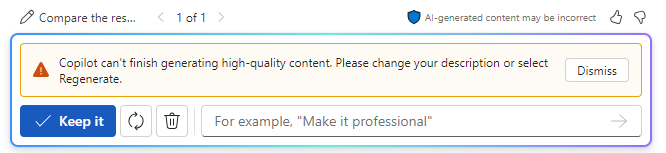

# Analizzare i curriculum e fare una raccomandazione usando Microsoft 365 Copilot in Word
---
Nell'esercizio precedente è stato illustrato come Microsoft 365 Copilot in Word possa aiutare i professionisti delle risorse umane a redigere una descrizione della mansione. In questo esercizio, verrà illustrato come automatizzare le fasi iniziali del processo di selezione dei curriculum. Questa funzionalità può aiutare i professionisti delle risorse umane a individuare rapidamente i candidati più idonei all'interno di un ampio bacino di candidature.

Quando si chiede a Copilot di generare un documento o applicare una modifica, può succedere che inizi a visualizzare la bozza e poi si fermi. Nel caso in cui si verifichi questa situazione, selezionare il pulsante **Rigenera** per generare una nuova bozza, oppure modificare la richiesta e riprovare.

### Esercizio

In qualità di Responsabile delle risorse umane presso Graphic Design Institute, l'utente ha avviato il processo di assunzione per un nuovo Senior Animation Designer. Il personale ha creato un documento che delinea tutte le responsabilità professionali per questo ruolo. Successivamente, è stata creata una descrizione della mansione, pubblicata sia sul Web che sul sito interno dell'azienda per i dipendenti. Ora si vuole usare Microsoft 365 Copilot in Word per vagliare un gruppo di curriculum ricevuti per il ruolo in questione e fornire una raccomandazione su quali candidati siano idonei per un colloquio di lavoro.

Al termine dell'esercizio precedente, è stato salvato il file contenente la descrizione della mansione creata. È stato richiesto di salvare il file come **Graphic Design Institute - Descrizioni del lavoro.docx**. Se è stato salvato come nome di file diverso, ricordare il nome usato in modo che sia possibile individuare il file in questo esercizio. In questo esercizio, seguire questa procedura per fare in modo che Microsoft 365 Copilot in Word confronti i quattro curriculum ricevuti con questo file di descrizione del lavoro per determinare quale candidato è più qualificato:

1.  Selezionare i collegamenti seguenti per scaricare i curriculum ricevuti finora:
     -  [Curriculum: Patti Fernandez](https://go.microsoft.com/fwlink/?linkid=2268829)
     -  [Curriculum: Nestor Wilke](https://go.microsoft.com/fwlink/?linkid=2268930)
     -  [Curriculum: Holly Dickson](https://go.microsoft.com/fwlink/?linkid=2268828)
     -  [Curriculum: Alex Wilber](https://go.microsoft.com/fwlink/?linkid=2269127)
2.  Al termine dei download, aprire **Esplora file** e copiare i file dalla cartella **Download** in una cartella nell'account OneDrive.
3.  In questo esercizio si accede ai documenti dall'elenco dei file usati di recente. Per visualizzare i file nell'elenco di file usati di recente, aprire ogni documento e quindi chiuderlo. Aprire e chiudere ciascuno dei quattro file di curriculum nell'account OneDrive.
4.  In **Microsoft 365**, aprire **Microsoft Word** e quindi aprire un nuovo documento vuoto.
5.  Nella finestra **Bozza con Copilot** che verrà visualizzata nella parte superiore del documento vuoto, inserire la seguente richiesta, ma senza ancora inviarla. È necessario allegare i file alla richiesta nel passaggio successivo:
    
    **Sono il responsabile delle assunzioni di Graphic Design Institute. Vogliamo assumere un Senior Animation Designer. Crea un report che confronti i curriculum allegati con i requisiti per la posizione di Senior Animation Designer presenti nel file di descrizione della mansione allegato e classifichi i candidati dal più qualificato al meno qualificato. Grazie!**
6.  Ora è necessario allegare alla richiesta il file **Graphic Design Institute - Job descriptions.docx** salvato sull'account OneDrive alla fine dell'esercizio precedente. Nella finestra **Bozza con Copilot**, selezionare il pulsante **Fare riferimento al contenuto**. Nel menu a discesa visualizzato, se il file di descrizione del lavoro viene visualizzato nell'elenco dei file, selezionarlo. In caso contrario, selezionare **Sfoglia file dal cloud**, individuare il file di descrizione del lavoro salvato nell'account di OneDrive nell'esercizio precedente e quindi selezionare il pulsante **Allega**. Notare come il file viene visualizzato nella richiesta.
7.  Ripetere il passaggio precedente per ciascuno dei quattro curriculum scaricati. Osservare cosa accade quando si tenta di allegare il terzo curriculum. Copilot visualizza un messaggio che indica che è possibile includere solo fino a tre file in una richiesta. Poiché è stato necessario includere il file della descrizione della mansione per fornire a Copilot i requisiti del ruolo, è possibile inviare solo due curriculum con questa richiesta iniziale.
8.  Poiché alla richiesta sono stati allegati il file della descrizione della mansione e i primi due curriculum, selezionare **Genera**. A questo punto, Copilot estrarrà le informazioni pertinenti dal file di descrizione della mansione e dai primi due curriculum, creando un report di confronto dei curriculum. A questo punto, si è in modalità bozza di Copilot.
9.  Esaminare i risultati di questa prima bozza.
    
    > **Importante:** osservarvare la finestra **Bozza con Copilot** e notare che non è presente il pulsante **Allega**. Quando si è in modalità bozza come si è attualmente, Copilot non consente di allegare altri file alle richieste successive. È possibile usare il campo di richiesta per modificare il documento, ma non è più possibile allegare un altro file. Tenere presente questo requisito mentre si procede con i passaggi successivi. Questa bozza corrente confronta solo i primi due curriculum. Per confrontare i due curriculum rimanenti con i due presenti nella bozza corrente, è necessario mantenere una bozza di questo report e quindi creare un secondo report che confronta i due curriculum rimanenti con il documento appena creato.
    
  Si sta ora esaminando la prima bozza del report che confronta i primi due curriculum con il file di descrizione del lavoro. Copilot offre la possibilità di rigenerare tutte le bozze desiderate fino a trovare quella desiderata. Anche se si ritiene che la prima bozza sia corretta, selezionare il pulsante **Rigenera** nella finestra **Bozza con Copilot** per creare una seconda bozza.

10. Esaminare la seconda bozza creata da Copilot. Nel mondo reale, è possibile ripetere questo processo fino a quando non si è soddisfatti di una bozza specifica. Se si desidera tornare a una bozza precedente per confrontarla con una bozza più recente, selezionare le frecce avanti (&gt;) e indietro (&lt;) per andare avanti e indietro attraverso le bozze. Confrontare le due bozze create e assicurarsi che quella preferita sia visualizzata (sarà **1 di 2** o **2 di 2**). Quando si trova una bozza da usare, selezionare il pulsante **Mantieni**.
    
    > **NOTA:** quando si seleziona **Mantieni**, Copilot passa dalla modalità bozza alla normale modalità Microsoft Word. Salvare automaticamente anche il documento **Confronto report** nell'account OneDrive.
11. A questo punto si è pronti per ricevere la revisione di Copilot dei due curriculum finali. Tuttavia, come indicato nel passaggio precedente, è necessario confrontare i due curriculum rimanenti con il documento **Confronto report** appena creato che ha confrontato i primi due curriculum. A tale scopo, è necessario aprire un nuovo documento di Word. Poiché si è ancora nella scheda **Word** nel browser con il documento di **Confronto report** corrente mostrato, selezionare **File** nel menu sopra la barra multifunzione di **Word** e quindi nella **pagina iniziale**, selezionare **Documento vuoto** nella sezione **Nuovo**. In questo modo si apre una nuova scheda nel browser insieme a un nuovo documento di Word.

12. Nella finestra **Bozza con Copilot**, immettere la richiesta seguente, ma non inviarla. È necessario allegare i due curriculum rimanenti e il primo **Report di confronto**alla richiesta nel passaggio successivo:
    
    **È stato un buon inizio. Creare un report che confronta i curriculum allegati con il report di confronto del curriculum precedente (allegato) e classificare i candidati dal più qualificato al meno qualificato. Grazie!**
13. È ora necessario allegare il report appena creato che ha confrontato i primi due curriculum, insieme ai due curriculum rimanenti. Dopo aver immesso la richiesta nel passaggio precedente, selezionare il pulsante **Fare riferimento al contenuto** nella finestra **Bozza con Copilot**. Nel menu a discesa visualizzato, il documento **Report di confronto dei curriculum** creato dovrebbe essere nella parte superiore dell'elenco di file. Selezionare il documento.
14. Nella finestra **Bozza con Copilot**, selezionare il pulsante **Fare riferimento al contenuto**. Nel menu a discesa visualizzato, è necessario allegare uno dei due curriculum rimanenti. Se viene visualizzato uno dei file nell'elenco dei file, selezionarlo. In caso contrario, selezionare **Sfoglia file dal cloud**, individuare uno dei due curriculum rimanenti (se si scorre l'elenco **File recenti** ), selezionarlo e quindi selezionare il pulsante **Allega**. Ripetere questo processo per selezionare il curriculum rimanente finale.
15. Dopo aver creato il primo report di confronto dei report e i due curriculum rimanenti collegati alla richiesta, selezionare il pulsante **Genera** nella finestra **Bozza con Copilot**.
16. Copilot deve confrontare i primi due curriculum e i due finali e fornire una classifica dei candidati. A questo punto, è possibile rigenerare una nuova bozza o chiedere a Copilot di apportare modifiche. Per questo esercizio di training, viene deciso di essere soddisfatti del report, quindi selezionare il pulsante **Mantieni**.
17. A questo punto, Copilot ha generato due report di confronto, il secondo dei quali è il report finale che confronta tutti e quattro i candidati. Tenere presente questo scenario se è necessario eseguire operazioni simili nel mondo reale usando Microsoft 365 Copilot in Word. Si vuole verificare che si stia usando il documento corretto in futuro. È possibile chiudere questa scheda nel browser Microsoft Edge.
